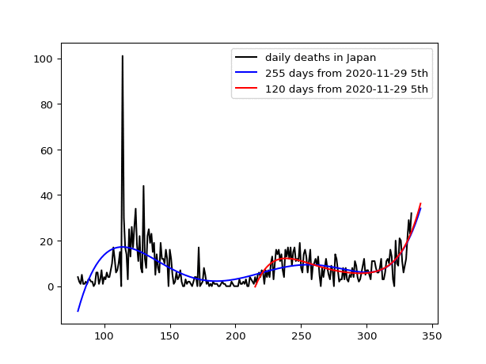

# japan

the number of daily deaths due to the covid-19 in Japan:
black line shows the number of daily deaths, blue line the predicted number of daily deaths using 245 days, red line the predicted number od daily deaths changing the number of days.

Data was downloaded from: 

https://raw.githubusercontent.com/owid/covid-19-data/master/public/data/jhu/new_deaths.csv

https://covid.ourworldindata.org/data/ecdc/new_deaths.csv

