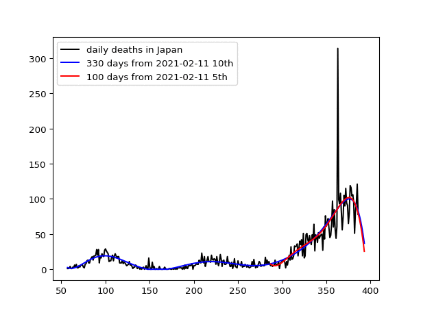

# japan

the number of daily deaths due to the covid-19 in Japan:
black line shows the number of daily deaths, blue line based on 10th degree polinomial predicting the number of daily deaths using 275 days, red line based on 5th degree polinomial predicting number of daily deaths by changing the number of days for curve-fitting.

Data was downloaded from: 

https://raw.githubusercontent.com/owid/covid-19-data/master/public/data/jhu/new_deaths.csv

This site is stopped: 
https://covid.ourworldindata.org/data/ecdc/new_deaths.csv

